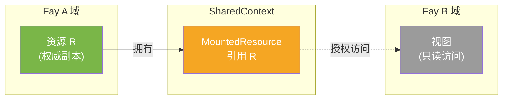
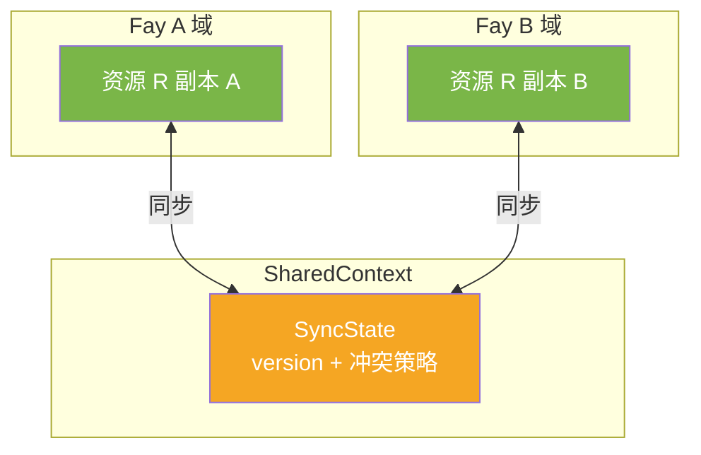
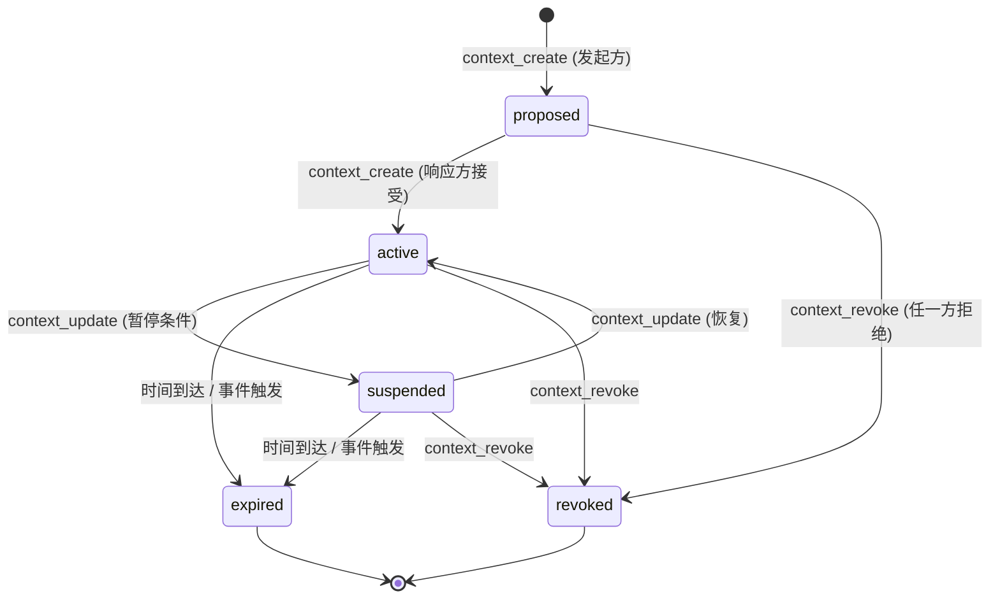

# 第 05 章 认知分享层

## 5.1 概述

认知分享层是 TP 的灵魂——它将 Fay 之间的协作从「序列化-传输-反序列化」的传话模式，升级为在受控空间中直接访问共享认知资源。

本章规定：

- `SharedContext` 的两种共享模式（§5.2）
- `SharedContext` 的生命周期与状态机（§5.3）
- 认知资源（`CognitiveResource`）的类型与挂载语义（§5.4）
- 访问控制（ACL）的执行规则（§5.5）
- 同步与冲突解决策略（§5.6）
- 端到端示例（§5.7）

## 5.2 共享模式

`SharedContext.mode` 字段定义了两种语义截然不同的共享模式。实现 MUST 在创建 SharedContext 时显式声明模式，且模式 MUST NOT 在生命周期内变更。

### 5.2.1 delegated_access（委托访问模式）

资源拥有方保留资源的真实存储与权威状态；其他参与方通过受控接口访问资源。

- **适用场景**：人类原型隐私数据访问、跨组织咨询、有审计要求的场景
- **数据物理位置**：仅在拥有方
- **访问方式**：通过 `MountedResource.permissions` 授予的能力调用拥有方的接口
- **修改语义**：仅拥有方可写；其他方的修改请求 MUST 被拒绝并返回 `TP-CTX011`



### 5.2.2 collaborative_space（协作空间模式）

参与方在共享空间中共同维护资源；多方都可读写。

- **适用场景**：多 Fay 协同编辑、实时会议视图、协作设计
- **数据物理位置**：每方维护一份副本，通过同步机制保持一致
- **访问方式**：直接读写，再通过 `SyncState` 同步给其他方
- **修改语义**：按 `SyncState.conflict_resolution` 策略解决冲突



`tp_core` 实现 MAY 不支持 `collaborative_space`；`tp_secure` 起 MUST 支持。

## 5.3 生命周期与状态机

### 5.3.1 状态枚举

`SharedContext.lifecycle.state` 的取值与含义：

| 状态 | 含义 |
|------|------|
| `proposed` | 一方已提议创建，等待其他方接受 |
| `active` | 所有参与方已接受，可挂载资源与协作 |
| `suspended` | 临时暂停（如人类原型撤销了部分授权但未完全终止） |
| `expired` | 已过期（达到 `expiration` 或触发 `expiration_event`） |
| `revoked` | 已撤销（任何参与方主动终止） |

`expired` 与 `revoked` 是终态。

### 5.3.2 状态转换图



### 5.3.3 转换规则

实现 MUST 严格执行下表的转换规则。任何不在表内的转换 MUST 返回 `TP-CTX003`。

| 起始状态 | 触发消息/事件 | 终止状态 | 谁可发起 |
|---------|-------------|---------|---------|
| `proposed` | 响应方发送 `context_create` 接受 | `active` | 任一其他参与方 |
| `proposed` | 任一方发送 `context_revoke` | `revoked` | 任一参与方 |
| `active` | 任一方发送 `context_update` 含 `state=suspended` | `suspended` | 资源拥有方或人类原型授权变更触发 |
| `suspended` | 任一方发送 `context_update` 含 `state=active` | `active` | 之前发起 `suspended` 的同一方 |
| `active`/`suspended` | 时间到达 `lifecycle.expiration` | `expired` | 系统自动 |
| `active`/`suspended` | `lifecycle.expiration_event` 触发 | `expired` | 系统自动 |
| `active`/`suspended` | 任一方发送 `context_revoke` | `revoked` | 任一参与方 |

### 5.3.4 终态行为

进入 `expired` 或 `revoked` 状态后：

- 实现 MUST 立即拒绝所有针对该 SharedContext 的资源访问请求（返回 `TP-CTX004`）
- 实现 MUST 在审计日志中记录终态转换的时间、原因、发起方
- 实现 MAY 在终态前广播一次最后通知给所有参与方
- 实现 MUST 在终态后保留 `context_id` 至少 24 小时以便审计查询，之后 MAY 清理

`tp_secure` 起 MUST 实现「立即终止」语义——`revoked` 状态发出后 100ms 内所有正在进行的资源访问 MUST 被中断。

### 5.3.5 时间过期与事件过期

`ContextLifecycle.expiration`（时间过期）与 `expiration_event`（事件过期）：

- 二者 MAY 同时存在；只要其一触发即进入 `expired`
- `expiration_event` 是由实现定义的事件标识符（如 `goal_completed:goal-id-xxx`）
- `tp_full` 起 MUST 支持 `expiration_event`

## 5.4 认知资源

### 5.4.1 资源类型

`CognitiveResourceType` 定义四类可共享的认知资源：

| 类型 | 含义 | 必备级别 | 典型用途 |
|------|------|---------|---------|
| `memory_fragment` | 会话级部分长期记忆 | `tp_core` | 病史摘要、知识片段、历史对话引用 |
| `view_state` | 界面/数据视图实时状态 | `tp_core` | 文档标注、协作画布、列表选中 |
| `reasoning_engine` | 推理逻辑与决策规则 | `tp_full` | 法规条文 + 推理链、领域规则集 |
| `environment_context` | 动态环境信息 | `tp_full` | 时间、地点、设备状态、传感器数据 |

实现支持的资源类型 MUST 与 `FayProfile.sharing_willingness.shareable_resource_types` 一致。

### 5.4.2 内容引用：内联与引用

资源内容通过 `CognitiveResource.content_ref` 表达，支持两种模式：

| 模式 | 适用 | 大小限制 |
|------|------|---------|
| `InlineContent` | 小数据嵌入消息 | 推荐 < 64 KB；MUST < 1 MB |
| `ReferenceContent` | 大数据 URI 引用 | 任意大小 |

实现 MUST：

- 数据 ≥ 1 MB 时使用 `ReferenceContent`；否则 MUST 拒绝并返回 `TP-CTX012`
- `ReferenceContent` 提供 `checksum` 时（SHOULD 提供），消费方 MUST 验证；不一致返回 `TP-CTX013`
- 数据 < 64 KB 时 SHOULD 使用 `InlineContent` 以减少额外网络往返

### 5.4.3 挂载语义

将资源挂载到 SharedContext 通过 `resource_mount` 消息完成。挂载 MUST 满足：

1. **拥有权一致**：`MountedResource.owner_fay_id` MUST 与 `resource.access_policy.owner_fay_id` 一致
2. **授权范围内**：拥有方 MUST 是 SharedContext 的参与方之一
3. **挂载点唯一**：同一 SharedContext 内 `mount_point` 字符串 MUST 唯一；冲突返回 `TP-CTX014`
4. **资源类型已声明**：拥有方的 `FayProfile.sharing_willingness.shareable_resource_types` MUST 包含该资源类型
5. **人类原型授权范围内**：如拥有方为 iFay，资源类型 MUST 在其 `HostAuthorization.authorized_resource_types` 内

挂载点路径采用类 Unix 文件系统约定，如 `/medical/diagnosis-2026/codes`、`/views/contract-doc/annotations`。

### 5.4.4 卸载与变更通知

- `resource_unmount`：从 SharedContext 移除资源；只能由 `owner_fay_id` 发起
- `resource_notify`：通知其他方资源已变更（用于 `delegated_access` 模式下的"轮询替代"）

`resource_notify` 的 `payload` SHOULD 包含变更摘要而非完整新内容，避免无关方下载未授权数据。

## 5.5 访问控制

### 5.5.1 ACL 模型

`SharedContext.access_control` 定义两层访问控制：

1. **`default_policy`**：默认策略——`deny_all`、`read_only`、`read_write`
2. **`per_resource_overrides`**：按资源覆盖——更细粒度的权限

每次访问的有效权限计算：**对每个 fay_id，先看 `per_resource_overrides`；如未指定，回退到 `default_policy`**。

### 5.5.2 ACL 执行规则

接收方收到对资源的访问请求（读/写/列举）时 MUST：

1. 检查 SharedContext 状态 MUST 为 `active`（`suspended` 也拒绝写）
2. 检查请求方 `fay_id` 是否为参与方
3. 解析有效权限（按 §5.5.1）
4. 验证操作类型（读/写）是否被允许
5. 对 `delegated_access` 模式且操作为写的请求，验证请求方 = `owner_fay_id`
6. 验证 `time_limited` 是否过期（如设置）

任一项失败 MUST 返回 `TP-CTX0XX` 错误（详见第 10 章）。

### 5.5.3 时间限制权限

`ResourcePermissions` 中的 `time_limited` 字段（ISO 8601 duration）定义权限的额外时间窗口：

- 起算点：权限被授予的时间（首次出现在 SharedContext 中）
- 过期后：所有操作 MUST 返回 `TP-CTX007`
- 超过 SharedContext 自身 `lifecycle.expiration` 的 `time_limited` 设置 MUST 被截断到 SharedContext 过期时间

## 5.6 同步与冲突解决

### 5.6.1 SyncState 字段

`SyncState`（详见 schema）的关键字段：

| 字段 | 角色 |
|------|------|
| `version` | 单调递增的版本号；每次变更 +1 |
| `last_sync_time` | 最近一次成功同步的时间戳 |
| `conflict_resolution` | 冲突解决策略 |
| `pending_changes` | 本地未同步的变更数量 |

### 5.6.2 三种冲突解决策略

| 策略 | 行为 | 适用 |
|------|------|------|
| `last_writer_wins` | 最后写入获胜（按时间戳） | 简单同步，`tp_core` 必备 |
| `crdt` | 使用 CRDT 数据结构合并 | 协作编辑，`tp_full` |
| `operational_transform` | OT 算法变换并合并 | 协作编辑，`tp_full` |

`tp_full` 起 MUST 至少支持 `crdt` 与 `operational_transform` 之一。

### 5.6.3 同步消息

`context_sync` 消息用于推送变更或请求重同步：

- **推送变更**：发起方将本地未同步变更（`pending_changes` 个）以增量形式发给对方
- **请求重同步**：发起方在检测到版本号断层时请求完整快照
- **冲突报告**：响应方在合并失败时返回 `TP-CTX020`，附带冲突详情

实现 MUST：

- 接收 `context_sync` 后 MUST 验证 `version` 单调递增
- 检测到版本断层（缺失中间版本）MUST 触发重同步
- `last_writer_wins` 策略下，时间戳完全相同的两次写入 MUST 按 `fay_id` 字典序决定胜者（保证确定性）

## 5.7 端到端示例

医疗 Fay A 与保险 coFay B 已完成身份握手（§04），现在 A 创建 SharedContext 并挂载诊断资源以便 B 进行理赔评估。

### 5.7.1 A 创建 SharedContext

```json
{
  "tp_version": "1.0.0",
  "message_id": "01902c4f-1a2b-7000-8000-000000000010",
  "sender": { /* fay:patient-zhang-3389 */ },
  "receiver": { /* fay:insurance-co-pingan */ },
  "timestamp": "2026-05-27T08:35:00.000Z",
  "message_type": "context_create",
  "payload": {
    "context_id": "ctx:claim-2026-001",
    "participants": [
      { "fay_id": "fay:patient-zhang-3389", "fay_type": "iFay", /* ... */ },
      { "fay_id": "fay:insurance-co-pingan", "fay_type": "coFay", /* ... */ }
    ],
    "mode": "delegated_access",
    "mounted_resources": [],
    "access_control": {
      "default_policy": "deny_all",
      "per_resource_overrides": []
    },
    "lifecycle": {
      "state": "proposed",
      "creation_time": "2026-05-27T08:35:00.000Z",
      "expiration": "2026-05-27T10:35:00.000Z",
      "last_state_change": "2026-05-27T08:35:00.000Z"
    },
    "sync_state": {
      "version": 1,
      "last_sync_time": "2026-05-27T08:35:00.000Z",
      "conflict_resolution": "last_writer_wins",
      "pending_changes": 0
    }
  },
  "signature": "<base64>"
}
```

### 5.7.2 B 接受（active 转换）

```json
{
  "tp_version": "1.0.0",
  "message_id": "01902c4f-1a2b-7000-8000-000000000011",
  "sender": { /* fay:insurance-co-pingan */ },
  "receiver": { /* fay:patient-zhang-3389 */ },
  "timestamp": "2026-05-27T08:35:01.000Z",
  "correlation_id": "01902c4f-1a2b-7000-8000-000000000010",
  "message_type": "context_create",
  "payload": {
    "context_id": "ctx:claim-2026-001",
    "lifecycle": {
      "state": "active",
      "last_state_change": "2026-05-27T08:35:01.000Z"
      /* 其他字段从原 proposed 继承 */
    }
  },
  "signature": "<base64>"
}
```

### 5.7.3 A 挂载诊断资源

```json
{
  "tp_version": "1.0.0",
  "message_id": "01902c4f-1a2b-7000-8000-000000000012",
  "sender": { /* fay:patient-zhang-3389 */ },
  "receiver": { /* fay:insurance-co-pingan */ },
  "timestamp": "2026-05-27T08:35:02.000Z",
  "message_type": "resource_mount",
  "payload": {
    "context_id": "ctx:claim-2026-001",
    "mounted_resource": {
      "resource": {
        "resource_id": "res:diagnosis-2026-001",
        "resource_type": "memory_fragment",
        "content_ref": {
          "mode": "inline",
          "data": {
            "diagnosis_codes": ["J45.901"],
            "treatment_dates": ["2026-05-20"],
            "cost_total_cny": 3850.00
          },
          "size_bytes": 128
        },
        "access_policy": {
          "owner_fay_id": "fay:patient-zhang-3389",
          "visibility": "shared",
          "requires_encryption": true
        },
        "schema_ref": "https://ifay.dev/schemas/medical-diagnosis/v1.json",
        "metadata": {
          "created_at": "2026-05-27T08:35:02.000Z",
          "updated_at": "2026-05-27T08:35:02.000Z",
          "version": 1,
          "description": "理赔申请相关诊断信息"
        }
      },
      "mount_point": "/medical/claim-2026-001/diagnosis",
      "owner_fay_id": "fay:patient-zhang-3389",
      "permissions": {
        "fay:insurance-co-pingan": {
          "read": true,
          "write": false,
          "time_limited": "PT2H"
        }
      }
    }
  },
  "signature": "<base64>"
}
```

注意 `requires_encryption: true` —— 实际的人类原型隐私数据 MUST 通过 `EncryptedPayload`（§07）传输；这里的 `data` 字段在 `tp_secure` 起 MUST 是 `EncryptedPayload` 而非明文。

### 5.7.4 完成后撤销

```json
{
  "tp_version": "1.0.0",
  "message_id": "01902c4f-1a2b-7000-8000-000000000020",
  "sender": { /* fay:patient-zhang-3389 */ },
  "receiver": { /* fay:insurance-co-pingan */ },
  "timestamp": "2026-05-27T09:15:00.000Z",
  "message_type": "context_revoke",
  "payload": {
    "context_id": "ctx:claim-2026-001",
    "lifecycle": {
      "state": "revoked",
      "revocation_reason": "claim_completed",
      "last_state_change": "2026-05-27T09:15:00.000Z"
    }
  },
  "signature": "<base64>"
}
```

收到此消息后 B 的实现 MUST：

1. 在 100ms 内中断所有针对 `ctx:claim-2026-001` 资源的正在进行的访问
2. 在审计日志记录撤销事件（详见 §07.4）
3. 清理本地缓存的 `delegated_access` 视图
4. 不再接受任何针对该 context 的请求

## 5.8 认知分享层错误码

| 错误码 | 触发条件 |
|-------|---------|
| `TP-CTX001` | `context_id` 不存在 |
| `TP-CTX002` | 请求方非 SharedContext 参与方 |
| `TP-CTX003` | 状态机非法转换 |
| `TP-CTX004` | 在终态（expired/revoked）执行操作 |
| `TP-CTX005` | 默认策略 deny_all 阻止访问 |
| `TP-CTX006` | per_resource 权限不足 |
| `TP-CTX007` | 时间限制权限已过期 |
| `TP-CTX008` | 写入操作但 SharedContext 处于 suspended |
| `TP-CTX011` | delegated_access 模式下非拥有方尝试写入 |
| `TP-CTX012` | 资源数据超过大小限制（≥1MB 必须用引用） |
| `TP-CTX013` | ReferenceContent 校验和不匹配 |
| `TP-CTX014` | 挂载点冲突（已存在） |
| `TP-CTX015` | 资源类型未在 sharing_willingness 中声明 |
| `TP-CTX016` | 资源类型超出 HostAuthorization 范围 |
| `TP-CTX020` | 同步冲突无法自动解决 |
| `TP-CTX021` | 同步版本断层（需重同步） |
