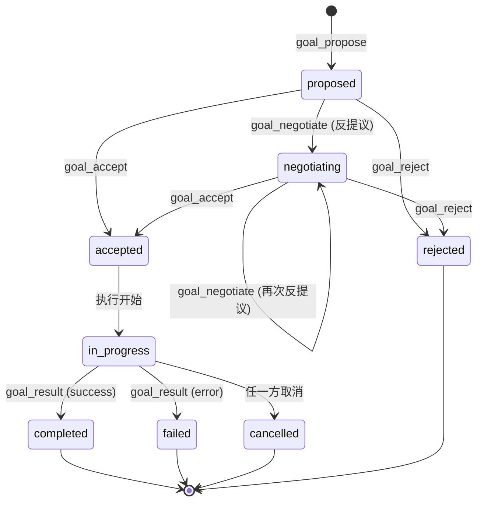

# 第 06 章 目标协商层

## 6.1 概述

目标协商层回答：**「我们要一起做什么？」**

`Goal` 统一了传统 Agent 协议中分裂的 `Intent`（意图）与 `Task`（任务）概念——意图是被讨论的目标，任务是已被接受的目标。同一个数据结构通过状态字段区分两者。

本章规定：

- Goal 类型与状态机（§6.2、§6.3）
- Goal 的提议、协商与执行流程（§6.4）
- 子目标 DAG 分解（§6.5）
- 咨询模式（§6.6）
- 端到端示例（§6.7）

## 6.2 Goal 类型

`GoalType` 枚举定义了六类 Goal。各类型的语义、是否要求响应、合规级别如下：

| 类型 | 语义 | 期望响应 | 必备级别 |
|------|------|---------|---------|
| `query` | 查询信息 | 必需 `goal_result` | `tp_core` |
| `execute` | 执行动作 | 必需 `goal_result` | `tp_core` |
| `notify` | 单向通知 | 不需 | `tp_core` |
| `subscribe` | 订阅事件流 | 持续 `goal_result`（多次） | `tp_full` |
| `delegate` | 委派任务 | 必需 `goal_result`（可异步） | `tp_full` |
| `consult` | 咨询（特殊：见 §6.6） | 必需 `consultation_response` | `tp_secure` |

实现 MUST 按一致性级别支持对应的 Goal 类型；接收到不支持的 `goal_type` MUST 返回 `TP-GOAL003`。

## 6.3 Goal 状态机

### 6.3.1 状态枚举

| 状态 | 含义 |
|------|------|
| `proposed` | 已提议，等待响应方决定 |
| `negotiating` | 响应方提出反提议，进入协商 |
| `accepted` | 双方达成一致，等待执行 |
| `in_progress` | 执行中 |
| `completed` | 成功完成 |
| `failed` | 执行失败 |
| `cancelled` | 执行中被取消 |
| `rejected` | 协商阶段被拒绝 |

`completed`、`failed`、`cancelled`、`rejected` 是终态。

### 6.3.2 状态转换图



### 6.3.3 转换规则

| 起始状态 | 触发 | 终止状态 | 谁可发起 |
|---------|------|---------|---------|
| `proposed` | `goal_negotiate` | `negotiating` | 接收方 |
| `proposed` | `goal_accept` | `accepted` | 接收方 |
| `proposed` | `goal_reject` | `rejected` | 接收方 |
| `negotiating` | `goal_negotiate` | `negotiating` | 任一方 |
| `negotiating` | `goal_accept` | `accepted` | 任一方 |
| `negotiating` | `goal_reject` | `rejected` | 任一方 |
| `accepted` | 执行方开始执行 | `in_progress` | 执行方 |
| `in_progress` | `goal_result` 含 success | `completed` | 执行方 |
| `in_progress` | `goal_result` 含 error | `failed` | 执行方 |
| `in_progress` | 任一方发取消信号 | `cancelled` | 任一方 |

非法转换 MUST 返回 `TP-GOAL004`。

### 6.3.4 协商轮次限制

为防止协商陷入死循环：

- 单个 Goal 的 `negotiating` 状态下 MUST 不超过 **10 次** `goal_negotiate` 往返
- 超过限制 MUST 自动转入 `rejected` 并返回 `TP-GOAL005`
- 实现 SHOULD 记录每次反提议的内容差异，便于审计

## 6.4 提议、协商与执行

### 6.4.1 goal_propose 消息

`message_type = "goal_propose"` 的 `payload` MUST 是一个 `Goal` 对象，且：

- `status` MUST 为 `proposed`
- `goal_id` MUST 全局唯一（推荐 UUID v7）
- `description.summary` MUST 非空
- `description.output_schema` MUST 提供（即使期望输出为空 `{}`）
- `parameters.values` MUST 符合 `parameters.schema_ref` 引用的 schema
- `context_ref` MUST 引用已建立的 `active` SharedContext（见 §6.4.2 例外）

### 6.4.2 无 SharedContext 的 Goal

某些 Goal 不需要预先建立 SharedContext：

- `notify` 类型——单向通知通常不需要持久共享空间
- 极简 `query`——临时性、无副作用的快速询问

此类 Goal 的 `context_ref` MAY 设为占位符 `"none"`。实现 MUST 在以下情况拒绝 `context_ref = "none"`：

- `goal_type` 涉及人类原型隐私数据（必须有审计上下文）
- `goal_type = consult`
- `goal_type = delegate`

### 6.4.3 goal_negotiate 消息

`payload` MUST 包含完整的 `Goal` 对象，反映反提议方期望的修改：

```json
{
  "goal_id": "<原 goal_id>",
  "status": "negotiating",
  /* 其他字段：反提议方期望的修改后值 */
  "negotiation_diff": {
    "changed_fields": ["constraints[0].value", "description.summary"],
    "rationale": "<反提议理由>"
  }
}
```

`negotiation_diff` 是规范扩展字段（在 schema 中作为 `Record<string, unknown>` 占位），SHOULD 提供以辅助审计。

### 6.4.4 goal_accept 消息

`payload`：

```json
{
  "goal_id": "<goal_id>",
  "status": "accepted",
  "accepted_at": "<ISO 8601>",
  "executor_fay_id": "<执行方 fay_id>"
}
```

`executor_fay_id` 标识执行方——通常是接收方，但在 `delegate` 类型下可能是第三方。

### 6.4.5 goal_result 消息

`payload` MUST 是 `GoalResult` 对象。`status` 为 `completed` 时 `output` MUST 符合原 Goal 的 `description.output_schema`；`status` 为 `failed` 时 `error` MUST 提供。

`subscribe` 类型的 Goal 可发送多次 `goal_result`——每次代表一个事件；流结束时发送 `status = completed` 的最终消息。

### 6.4.6 取消语义

任一方在 `in_progress` 状态发送 `goal_result` 含特殊 `error_code = "GOAL_CANCELLED"`，将 Goal 转入 `cancelled`。执行方收到取消请求 SHOULD 在合理时间（通常 ≤ 5 秒）内停止执行并清理资源。

## 6.5 子目标 DAG

### 6.5.1 DAG 规则

`Goal.sub_goals` 字段允许将复杂目标分解为子目标，子目标依赖关系 MUST 构成有向无环图（DAG）：

- 每个 `SubGoalReference.sub_goal_id` MUST 引用同一会话内已存在的另一个 `Goal`
- `depends_on` 数组列出该子目标依赖完成的其他子目标 ID
- 实现 MUST 检测循环依赖；检测到循环 MUST 拒绝并返回 `TP-GOAL010`
- 自引用（`sub_goal_id` 出现在自身 `depends_on`）MUST 拒绝

### 6.5.2 执行顺序

执行方 MUST 按拓扑序执行子目标：

- 一个子目标 MUST 在其所有 `depends_on` 子目标都进入 `completed` 后才能进入 `in_progress`
- 任一子目标进入 `failed` 或 `cancelled`，所有尚未开始的依赖该子目标的子目标 MUST 自动转入 `cancelled`，返回 `TP-GOAL011`
- 无依赖关系的子目标 MAY 并行执行（实现自决）

### 6.5.3 父目标状态计算

父 Goal 的状态由子目标聚合决定：

| 子目标状态 | 父目标状态 |
|----------|---------|
| 全部 `completed` | `completed` |
| 任一 `failed` 或 `cancelled` 且无重试 | `failed` |
| 至少一个 `in_progress` 或 `accepted` | `in_progress` |

`tp_full` 起 MUST 支持子目标 DAG。

## 6.6 咨询模式

### 6.6.1 概念

咨询是一种特殊的 Goal（`goal_type = "consult"`）：一方需要从另一方获取受授权的隐私数据以辅助决策。咨询模式的核心是回调凭证（`CallbackCredential`，详见 §07）。

### 6.6.2 ConsultationRequest 与 ConsultationResponse

咨询不通过普通的 `goal_propose`/`goal_result` 消息对，而使用专用消息类型 `consultation_request` 与 `consultation_response`。

`consultation_request` 消息的 `payload` MUST 是 `ConsultationRequest` 对象，必含：

- `consultation_id`：UUID
- `query_type`：领域定义的查询类型
- `required_info_schema`：期望响应数据的 schema
- `authorization_scope`：所需权限范围

`tp_secure` 起 MUST 在 `authorization_scope.host_delegation` 中携带 `fp_authorization_ref`。

### 6.6.3 同步与异步响应

咨询的响应可同步或异步：

- **同步**：响应方在合理时间（≤30 秒）内通过 `consultation_response` 直接返回
- **异步**：响应方先返回 `consultation_response` 含 `status = partial` 与 callback 信息，然后通过 `callback_url` 在后续异步推送结果

异步咨询时 `callback_config.timeout_ms` MUST 提供，超时未响应进入 `rejected`。

### 6.6.4 链式咨询

`ConsultationRequest.chained_from` 字段支持咨询链：

- 一方收到咨询请求后，可能需要向第三方再发起咨询才能完整回答
- 子咨询的 `chained_from` MUST 引用父咨询的 `consultation_id`
- 链长度 MUST 不超过 **5 跳**——超过返回 `TP-GOAL020`
- 链中每一跳的 `authorization_scope` MUST 显式重新授权（不允许隐式继承）

`tp_full` 起 MUST 支持链式咨询。

### 6.6.5 拒绝与部分响应

`ConsultationResponse.status`：

- `fulfilled`：完全满足请求
- `partial`：部分满足（在 `data` 中说明哪些字段未提供与原因）
- `rejected`：拒绝（`rejection_reason` 必填）

实现 MUST：

- 拒绝时 MUST 在审计日志记录拒绝原因
- 部分响应时 MUST 在 `data` 中说明缺失字段（如 `_partial_fields`）
- 即使拒绝也 MUST 在审计日志记录请求方与查询类型（用于异常检测）

## 6.7 端到端示例

承接 §05.7：保险 coFay B 已可访问 SharedContext 中的诊断资源，现在它发起一个 `query` Goal 请求 A 提供费用明细分类。

### 6.7.1 B 提议 Goal

```json
{
  "tp_version": "1.0.0",
  "message_id": "01902c4f-1a2b-7000-8000-000000000030",
  "sender": { /* fay:insurance-co-pingan */ },
  "receiver": { /* fay:patient-zhang-3389 */ },
  "timestamp": "2026-05-27T08:40:00.000Z",
  "message_type": "goal_propose",
  "payload": {
    "goal_id": "goal:claim-2026-001:cost-breakdown",
    "goal_type": "query",
    "description": {
      "summary": "请求费用明细分类",
      "detailed": "为完成理赔评估，需要将总费用 3850 CNY 分类为药品、检查、住院等项目",
      "output_schema": {
        "type": "object",
        "properties": {
          "categories": {
            "type": "array",
            "items": {
              "type": "object",
              "properties": {
                "category": { "type": "string" },
                "amount_cny": { "type": "number" }
              }
            }
          }
        }
      }
    },
    "parameters": {
      "schema_ref": "https://ifay.dev/schemas/cost-query/v1.json",
      "values": {
        "currency": "CNY",
        "include_subcategories": true
      }
    },
    "constraints": [
      {
        "constraint_type": "deadline",
        "value": "2026-05-27T08:50:00.000Z",
        "required": true
      }
    ],
    "sub_goals": [],
    "context_ref": "ctx:claim-2026-001",
    "status": "proposed"
  },
  "signature": "<base64>"
}
```

### 6.7.2 A 接受

```json
{
  "tp_version": "1.0.0",
  "message_id": "01902c4f-1a2b-7000-8000-000000000031",
  "sender": { /* fay:patient-zhang-3389 */ },
  "receiver": { /* fay:insurance-co-pingan */ },
  "timestamp": "2026-05-27T08:40:01.500Z",
  "correlation_id": "01902c4f-1a2b-7000-8000-000000000030",
  "message_type": "goal_accept",
  "payload": {
    "goal_id": "goal:claim-2026-001:cost-breakdown",
    "status": "accepted",
    "accepted_at": "2026-05-27T08:40:01.500Z",
    "executor_fay_id": "fay:patient-zhang-3389"
  },
  "signature": "<base64>"
}
```

### 6.7.3 A 返回结果

```json
{
  "tp_version": "1.0.0",
  "message_id": "01902c4f-1a2b-7000-8000-000000000032",
  "sender": { /* fay:patient-zhang-3389 */ },
  "receiver": { /* fay:insurance-co-pingan */ },
  "timestamp": "2026-05-27T08:42:30.000Z",
  "correlation_id": "01902c4f-1a2b-7000-8000-000000000030",
  "message_type": "goal_result",
  "payload": {
    "goal_id": "goal:claim-2026-001:cost-breakdown",
    "status": "completed",
    "output": {
      "categories": [
        { "category": "medication",   "amount_cny": 1250.00 },
        { "category": "examination",  "amount_cny": 800.00 },
        { "category": "consultation", "amount_cny": 300.00 },
        { "category": "hospitalization", "amount_cny": 1500.00 }
      ]
    }
  },
  "signature": "<base64>"
}
```

## 6.8 目标协商层错误码

| 错误码 | 触发条件 |
|-------|---------|
| `TP-GOAL001` | `goal_id` 不存在或重复 |
| `TP-GOAL002` | `parameters.values` 不符合 `schema_ref` |
| `TP-GOAL003` | `goal_type` 在当前一致性级别下不支持 |
| `TP-GOAL004` | 状态机非法转换 |
| `TP-GOAL005` | 协商往返超过 10 次限制 |
| `TP-GOAL006` | `description.output_schema` 缺失或无效 |
| `TP-GOAL007` | `context_ref` 引用的 SharedContext 不存在或非 active |
| `TP-GOAL008` | `context_ref = "none"` 但目标类型要求审计上下文 |
| `TP-GOAL009` | `output` 不符合声明的 `output_schema` |
| `TP-GOAL010` | 子目标 DAG 检测到循环依赖 |
| `TP-GOAL011` | 父目标因子目标失败而级联取消 |
| `TP-GOAL012` | `constraints` 中 `required: true` 的约束无法满足 |
| `TP-GOAL020` | 咨询链超过 5 跳限制 |
| `TP-GOAL021` | `consultation_request` 缺少必备 `authorization_scope` |
| `TP-GOAL022` | 异步咨询超时未响应 |
