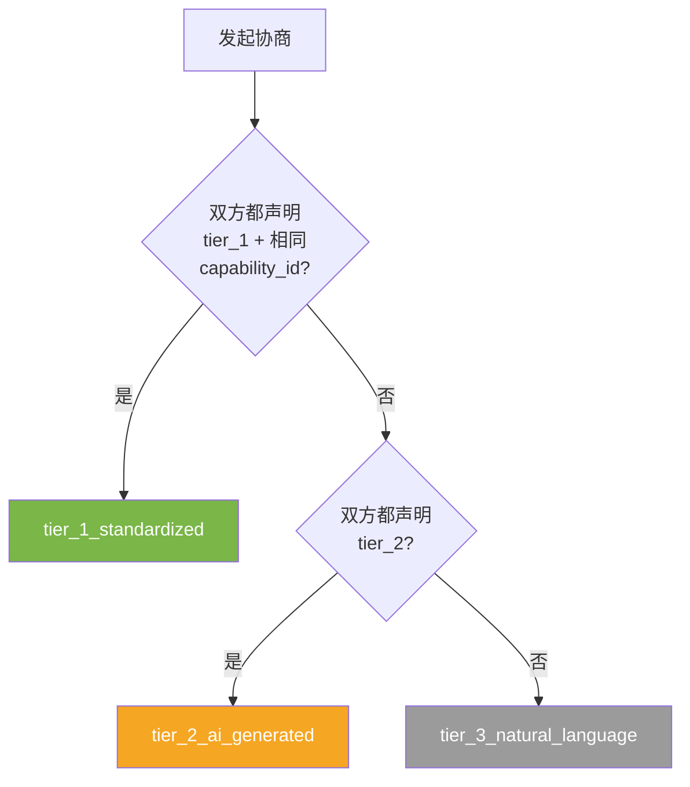
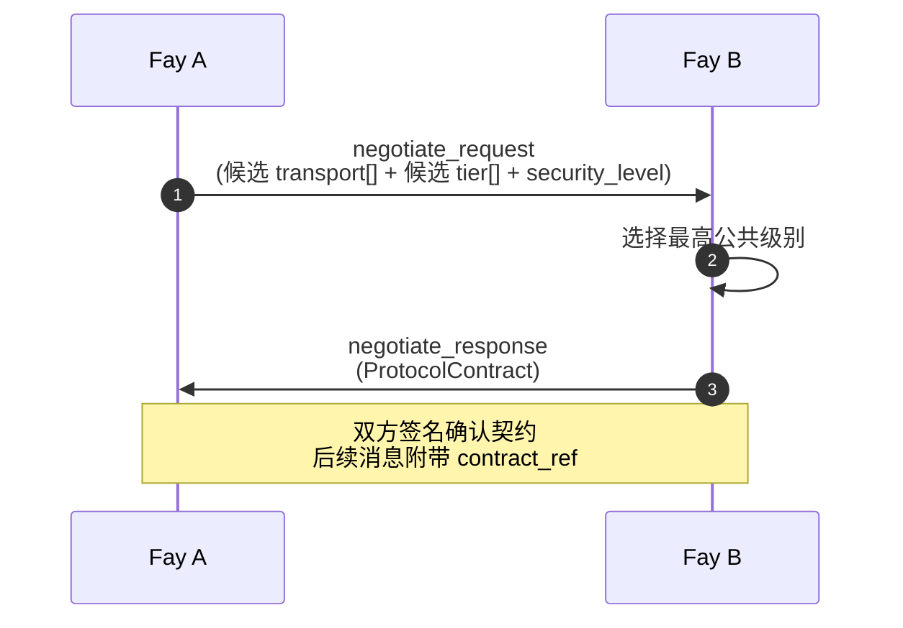

# 第 08 章 协议协商

## 8.1 概述

协议协商解决两个问题：

1. **「我们用什么语言交谈？」**——三级通信级别（标准化、AI 生成、自然语言）
2. **「我们用什么管道？」**——传输方式选择（详见第 09 章）

协商结果固化为 `ProtocolContract`，作为后续所有消息的元数据基础。

本章规定：

- 三级通信级别的语义与适用（§8.2）
- `ProtocolContract` 的字段与生命周期（§8.3）
- 协商流程与降级策略（§8.4）
- 端到端示例（§8.5）

## 8.2 三级通信级别

### 8.2.1 设计灵感

三级模型受 [Agora 协议](https://agora.network)启发。核心洞察：通信效率与灵活性不可兼得，因此让两端协商出最高效的共同语言，同时保留向下兼容的兜底。

| 级别 | 标识符 | 效率 | 灵活性 |
|------|-------|------|------|
| 标准化例程 | `tier_1_standardized` | 最高 | 最低 |
| AI 生成例程 | `tier_2_ai_generated` | 中 | 中 |
| 自然语言兜底 | `tier_3_natural_language` | 最低 | 最高 |

### 8.2.2 tier_1_standardized（标准化例程）

预先约定的参数表与消息格式。两端有相同的 `capability_id` 与 `version`，按事先约定的二进制或紧凑 JSON 格式直接交换数据。

- **特征**：零解释开销、最高带宽利用率、固定字段
- **适用**：高频高吞吐场景，如金融交易、IoT 数据流
- **代价**：双方 MUST 对 `CapabilityDescriptor` 完全一致；任何字段变更需协议升级

`tp_full` 必备。

### 8.2.3 tier_2_ai_generated（AI 生成例程）

两端通过协商动态生成会话级专用协议——发起方提供期望接口（`input_schema` + `output_schema`），响应方理解并生成处理代码。后续交互按生成的 schema 进行。

- **特征**：动态适配、不需预先一致、有一定解释开销
- **适用**：跨组织临时协作、新能力探索
- **代价**：协商阶段需要 LLM 推理；运行时仍是结构化数据

`tp_secure` 起必备。

### 8.2.4 tier_3_natural_language（自然语言兜底）

通过自然语言文本交换。每条消息的 `payload` 中携带的是文本描述而非结构化数据。

- **特征**：最高灵活性、零预先约定、依赖双方 LLM 理解
- **适用**：完全异构的 Fay 之间首次接触、调试、降级
- **代价**：解释开销大、易产生歧义、不适合高频

`tp_core` 起必备——是任何 TP 实现的最低要求。

### 8.2.5 级别选择决策

协商时 SHOULD 按以下顺序尝试：



实现 MUST 优先选择最高级别——降级是为了兼容，不是为了简化实现。

## 8.3 ProtocolContract

### 8.3.1 字段约束

| 字段 | 约束 |
|------|------|
| `contract_id` | 全局唯一 UUID v7 |
| `transport_method` | 协商出的传输方式（详见 §09） |
| `communication_tier` | 协商出的通信级别 |
| `security_level` | `basic` / `standard` / `high`（与 §07 加密要求挂钩） |
| `contract_expiration` | ISO 8601；MUST ≤ 24 小时 |
| `negotiation_trace` | 至少 1 个 `NegotiationStep`；记录协商过程 |

### 8.3.2 安全级别

`security_level` 决定本会话的最低安全要求：

| 级别 | 要求 |
|------|------|
| `basic` | 仅传输层 TLS + 信封签名（`tp_core` 默认） |
| `standard` | 上述 + 隐私字段加密（`tp_secure` 默认） |
| `high` | 上述 + 全 payload 加密 + 选择性披露 + 审计强制 |

实现 MUST 在以下情况选择 `high`：

- 涉及人类原型隐私数据
- 跨组织协作
- `goal_type = consult`

### 8.3.3 契约生命周期

`ProtocolContract` 在协商完成后**冻结**——除非重新协商，否则字段 MUST NOT 变更。

- 过期：到达 `contract_expiration` 后 MUST 重新协商
- 吊销：任一方可通过 `negotiate_request` 提议作废当前契约
- 升级：在不冲突的前提下 MAY 协商更高级别（如 tier_3 → tier_2）；MUST 通过新一轮 `negotiate_request` 完成

### 8.3.4 契约引用

后续所有消息的 `MessageEnvelope.protocol_contract_ref` SHOULD 引用契约 ID。接收方收到无 `protocol_contract_ref` 的消息时：

- 如已建立活跃契约，MAY 隐式应用最新契约
- 如无活跃契约，MUST 拒绝并返回 `TP-NEG010`

## 8.4 协商流程

### 8.4.1 协商消息

协商通过 `negotiate_request` 与 `negotiate_response` 完成：



### 8.4.2 negotiate_request 消息

`payload`:

```json
{
  "candidate_transports": [
    { "protocol": "native_tp", "endpoint": "wss://..." },
    { "protocol": "a2a_jsonrpc", "endpoint": "https://..." }
  ],
  "candidate_tiers": ["tier_1_standardized", "tier_2_ai_generated", "tier_3_natural_language"],
  "preferred_security_level": "high",
  "session_purpose": "<可选：会话目的提示>"
}
```

发起方 MUST 按偏好顺序列出候选——响应方将按列表顺序选择第一个双方都支持的项。

### 8.4.3 negotiate_response 消息

`payload` 是完整的 `ProtocolContract` 对象，且：

- `transport_method` MUST 来自请求的 `candidate_transports`
- `communication_tier` MUST 来自请求的 `candidate_tiers`
- `security_level` MUST ≥ 请求的 `preferred_security_level`
- `negotiation_trace` MUST 包含本次协商的步骤记录

如响应方无法满足任一候选，MUST 返回 `TP-NEG003`，但 SHOULD 提议替代方案：

```json
{
  "rejected": true,
  "reason": "no_common_tier",
  "alternative_proposal": {
    "candidate_transports": [...],
    "candidate_tiers": ["tier_3_natural_language"]
  }
}
```

### 8.4.4 降级策略

降级 MUST 是显式的——双方都同意后才生效。下表列出常见降级路径：

| 原始请求 | 响应方能力不足 | 降级到 |
|---------|--------------|------|
| tier_1 + 相同 capability | capability 版本不一致 | tier_2 |
| tier_2 + AI 生成 | 响应方不支持 tier_2 | tier_3 |
| security_level: high | 响应方不支持端到端加密 | 拒绝（不允许降级安全级别） |
| transport: native_tp | 响应方仅支持 a2a_jsonrpc | a2a_jsonrpc |

**安全级别的降级 MUST NOT 隐式发生**——若发起方要求 `high` 而响应方仅能提供 `standard`，MUST 返回 `TP-NEG004` 让发起方决定是否手动降级（重新发起协商请求）。

### 8.4.5 协商超时与重试

- 协商请求超时 MUST 在 30 秒内
- 超时后发起方 MAY 重试，最多 3 次
- 3 次失败后 MUST 放弃并向上层报错 `TP-NEG020`

## 8.5 端到端示例

患者 iFay A 与医院 coFay B 在身份握手后协商协议。

### 8.5.1 A 发起协商

```json
{
  "tp_version": "1.0.0",
  "message_id": "01902c4f-1a2b-7000-8000-000000000050",
  "sender": { /* fay:patient-zhang-3389 */ },
  "receiver": { /* fay:hospital-shanghai-east */ },
  "timestamp": "2026-05-27T08:31:00.000Z",
  "message_type": "negotiate_request",
  "payload": {
    "candidate_transports": [
      { "protocol": "native_tp", "endpoint": "wss://hospital-east.gov.cn/tp/v1", "version": "1.0.0" },
      { "protocol": "a2a_jsonrpc", "endpoint": "https://hospital-east.gov.cn/a2a", "version": "1.0.0" }
    ],
    "candidate_tiers": [
      "tier_2_ai_generated",
      "tier_3_natural_language"
    ],
    "preferred_security_level": "high",
    "session_purpose": "claim_consultation"
  },
  "signature": "<base64>"
}
```

### 8.5.2 B 响应契约

```json
{
  "tp_version": "1.0.0",
  "message_id": "01902c4f-1a2b-7000-8000-000000000051",
  "sender": { /* fay:hospital-shanghai-east */ },
  "receiver": { /* fay:patient-zhang-3389 */ },
  "timestamp": "2026-05-27T08:31:01.000Z",
  "correlation_id": "01902c4f-1a2b-7000-8000-000000000050",
  "message_type": "negotiate_response",
  "payload": {
    "contract_id": "01902c4f-1a2b-7000-8000-aaaa00000001",
    "transport_method": {
      "protocol": "native_tp",
      "endpoint": "wss://hospital-east.gov.cn/tp/v1",
      "version": "1.0.0"
    },
    "communication_tier": "tier_2_ai_generated",
    "security_level": "high",
    "contract_expiration": "2026-05-28T08:31:01.000Z",
    "negotiation_trace": [
      {
        "step": 1,
        "initiator_fay_id": "fay:patient-zhang-3389",
        "proposed": [
          { "protocol": "native_tp", "endpoint": "wss://hospital-east.gov.cn/tp/v1" },
          { "protocol": "a2a_jsonrpc", "endpoint": "https://hospital-east.gov.cn/a2a" }
        ],
        "selected": null,
        "timestamp": "2026-05-27T08:31:00.000Z"
      },
      {
        "step": 2,
        "initiator_fay_id": "fay:hospital-shanghai-east",
        "proposed": [],
        "selected": {
          "protocol": "native_tp",
          "endpoint": "wss://hospital-east.gov.cn/tp/v1"
        },
        "timestamp": "2026-05-27T08:31:01.000Z"
      }
    ]
  },
  "signature": "<base64>"
}
```

后续所有消息的 `MessageEnvelope.protocol_contract_ref` MUST 引用 `01902c4f-1a2b-7000-8000-aaaa00000001`。

## 8.6 协议协商错误码

| 错误码 | 触发条件 |
|-------|---------|
| `TP-NEG001` | `candidate_transports` 为空 |
| `TP-NEG002` | `candidate_tiers` 为空 |
| `TP-NEG003` | 无共同传输方式 |
| `TP-NEG004` | 安全级别不可满足（不允许降级） |
| `TP-NEG005` | tier_1 选择但 `capability_id` 不一致 |
| `TP-NEG006` | tier_2 但响应方无 LLM 推理能力 |
| `TP-NEG010` | 后续消息缺少 `protocol_contract_ref` |
| `TP-NEG011` | 引用的契约不存在 |
| `TP-NEG012` | 引用的契约已过期 |
| `TP-NEG020` | 协商超时（3 次重试失败） |
