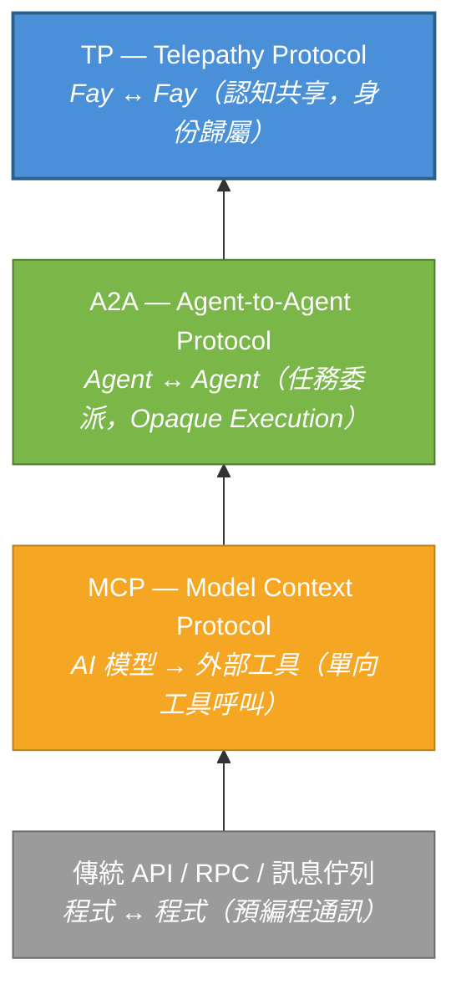
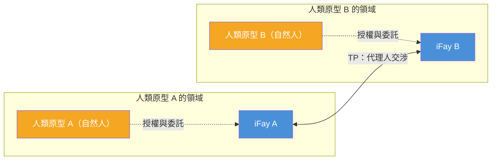

# 第一章 為什麼需要 TP

### 1.1 通訊協定層次分析

在過去數十年的軟體工程實務中，通訊協定的演進始終圍繞一個核心命題展開：**如何讓兩個運算實體更有效率地交換資訊**。隨著 AI Agent 生態的崛起，這一命題正在經歷根本性的典範轉移。

#### 傳統 API / RPC / 訊息佇列：程式與程式的預編程通訊

傳統通訊協定——無論是 RESTful API、gRPC 還是訊息佇列（如 Kafka、RabbitMQ）——解決的是**程式與程式之間的預編程通訊**問題。其核心特徵在於：呼叫方在編碼階段就已確定呼叫目標、呼叫方式和傳遞參數。介面契約（Interface Contract）在部署前即已固化，執行時期的彈性極為有限。

這種模式在確定性系統中運作良好，但面對 AI Agent 的動態性和自主性時，其侷限性暴露無遺——Agent 需要在執行時期發現能力、協商意圖、動態組合服務，而非在編碼時硬編碼一切。

> **現實範例**：一個旅行規劃 Agent 需要同時呼叫航班查詢、飯店預訂、天氣預報和簽證諮詢等多個服務。在傳統 API 模式下，開發者必須在編碼時就確定每個服務的 endpoint、參數格式和呼叫順序。如果使用者臨時改變目的地，整個呼叫鏈可能需要重新編排——而這在執行時期是極其困難的。

#### MCP（Model Context Protocol）：AI 模型與外部工具的連接

2024 年，Anthropic 發布了 Model Context Protocol（MCP），旨在解決 AI 模型與外部工具之間的連接問題。MCP 的核心架構遵循 **Host → Client → Server** 模型，為 AI 提供了一套「工具箱發現機制」——模型在執行時期可以動態發現可用工具、理解工具的輸入輸出 Schema，並發起呼叫。

然而，MCP 的通訊方向是**單向的**。AI 模型始終是主動方，工具始終是被動方。工具不會主動向模型推送資訊，也不會與其他工具協商。MCP 解決了「AI 如何使用工具」的問題，但並未觸及「Agent 之間如何協作」的命題。

> **現實範例**：一個客服 Agent 透過 MCP 連接了知識庫搜尋工具和工單系統。當使用者的問題超出客服 Agent 的能力範圍時，它需要將問題轉交給技術支援 Agent。但 MCP 沒有提供 Agent 之間的通訊機制——客服 Agent 只能呼叫工具，不能「找同事幫忙」。

#### A2A（Agent-to-Agent Protocol）：Agent 之間的任務委派與協作

2025 年，Google 發布了 Agent-to-Agent Protocol（A2A），將通訊的視角從「模型與工具」提升到「Agent 與 Agent」。A2A 引入了三個關鍵概念：

- **AgentCard**（能力名片）：Agent 向外界宣告自身能力的標準化描述
- **Task**（任務）：Agent 之間傳遞的可執行工作單元
- **Message**（訊息）：任務執行過程中的資訊交換載體

A2A 使得不同 Agent 能夠互相發現能力、委派任務、回報進度。但其核心設計原則——**Opaque Execution（不透明執行）**——明確規定：Agent 之間不共享內部狀態、記憶或工具實作細節。每個 Agent 是一個黑盒，只暴露輸入輸出介面。

> **現實範例**：一個專案管理 Agent 委派程式碼審查任務給程式碼審查 Agent。在 A2A 模式下，專案管理 Agent 必須將完整的程式碼差異、專案規範、歷史審查記錄全部序列化為訊息發送過去。程式碼審查 Agent 完成後回傳結果，但專案管理 Agent 無法「看到」審查過程中的推理邏輯——它只能看到最終的審查意見。如果需要追問「為什麼這段程式碼被標記為有風險」，又需要一輪完整的訊息往返。

#### TP：在 MCP / A2A 之上的認知共享層

Telepathy Protocol（TP）並非要取代上述任何一層協定，而是在它們之上建立一個全新的**認知共享層**。

下圖展示了這四層協定的遞進關係：

每一層協定的出現，都是因為上一層無法回答新的問題。傳統 API 無法應對 AI 的動態性，MCP 無法支撐 Agent 間協作，A2A 無法實現認知共享——而 TP 正是為填補這最後一塊空白而設計的。

### 1.2 代理人交涉範式

#### 現有協定的隱含假設

MCP、A2A 以及絕大多數現有通訊協定，都隱含著一個共同假設：**通訊雙方是獨立的、無主的服務實體**。

在 MCP 的世界中，工具是一個無狀態的函式——誰呼叫都一樣，不關心呼叫者代表誰。在 A2A 的世界中，Agent 是一個自治的服務節點——它接受任務、執行任務、回傳結果，但不關心任務背後的委託人是誰，也不需要保護任何人的利益。

這種假設在技術服務場景中是合理的。但當 AI Agent 開始代表真實的人類行事時，這種假設就不再成立了。

#### iFay 的世界觀：每個 Fay 都有人類原型

在 iFay 體系中，世界觀截然不同。每一個 Fay（無論是代表個人的 iFay，還是承擔社會公共職能的 coFay）都有明確的**人類原型（Human Prime）**。Fay 代表人類原型行事，維護人類原型的利益，保護人類原型的隱私。

這意味著，當兩個 Fay 進行通訊時，本質上發生的並非兩個軟體服務之間的資料交換，而是**兩個人類原型的代理人之間的交涉**——如同律師代表當事人談判，秘書代表老闆協調事務。

這種「代理人交涉」範式對通訊協定提出了全新的要求：

- **身份歸屬**：協定必須明確每個通訊實體代表誰。例如，當一個 Fay 代表病患向醫院的 coFay 預約掛號時，醫院 coFay 需要確認「這個 Fay 確實被該病患授權代為預約」，而非任何人都可以冒充病患的 Fay 來操作。
- **信任邊界**：代理人之間的資訊共享必須在人類原型授權的範圍內進行。例如，病患授權其 Fay 可以向醫院共享過敏史和目前症狀，但不允許共享心理諮商記錄——Fay 必須嚴格遵守這個邊界。
- **隱私保護**：人類原型的敏感資料在傳輸過程中必須受到加密保護，且支援選擇性揭露。例如，保險理賠時只需要揭露診斷編碼和費用明細，而不需要暴露完整的病歷內容。
- **可稽核性**：所有代理人行為必須可追溯，以便人類原型事後審查。例如，人類原型可以查看「我的 Fay 在過去一週內向哪些 Fay 共享了什麼資料」，就像查看銀行帳戶的交易記錄一樣。

### 1.3 現有協定的盲區

綜合以上分析，現有協定在面對「代理人交涉」場景時，存在三個根本性的盲區：

#### 無身份歸屬

MCP 和 A2A 均不關心 Agent 代表誰。MCP 中的工具沒有「歸屬」概念；A2A 中的 AgentCard 描述的是 Agent 自身的能力，而非其背後委託人的身份和授權。在 TP 的視角下，**沒有身份歸屬的通訊是不完整的**——它無法建立信任基礎，也無法界定責任邊界。

> **現實範例**：設想一個房產仲介 Agent 代表買家與賣家的 Agent 協商價格。在 A2A 模式下，賣家 Agent 無法驗證「對方真的代表一個有購買意向的買家」，也無法確認「買家是否授權了這個價格範圍的談判」。這就像一個沒有出示委託書的陌生人聲稱代表某人來談生意——缺乏信任基礎。

#### 無隱私保護

現有協定缺乏針對人類原型隱私資料的系統性保護機制。MCP 的 tool call 以明文傳遞參數；A2A 的 Message 同樣不提供端到端加密或選擇性揭露能力。當 Agent 需要代表人類原型傳遞健康記錄、財務資料或身份憑證時，現有協定無法提供充分的安全保障。

> **現實範例**：一個求職者的 Fay 向徵才公司的 coFay 提交履歷。求職者只想揭露工作經歷和技能，但不想暴露目前薪資和住家地址。在 A2A 模式下，要麼全部發送（隱私洩露），要麼不發送（無法完成求職）。沒有「只讓對方看到我允許看到的部分」的機制。

#### 無共享認知

A2A 明確宣告了 Opaque Execution 原則——Agent 之間不共享內部狀態。這一設計在鬆耦合的服務編排場景中是合理的，但在需要深度協作的場景中卻成為瓶頸。

當兩個 Fay 需要就同一份文件進行討論、共同推理一個複雜問題、或在同一個視圖上協作時，「不共享內部狀態」意味著每一輪互動都必須將全部相關資訊序列化傳輸——這不僅低效，更會在反覆的序列化與反序列化過程中引入資訊損耗和語意歧義。

> **現實範例**：兩個建築設計 Fay 需要協作設計一棟建築。在 A2A 模式下，Fay A 畫了一版平面圖，序列化為訊息發給 Fay B；Fay B 提出修改意見，又把整個圖紙序列化發回來；Fay A 再修改，再發……每一輪都是完整圖紙的傳輸。而如果雙方能共享同一個設計視圖（就像兩個建築師站在同一張圖紙前），一方畫一條線，另一方立即看到——效率將提升數個量級。

TP 的誕生，正是為了填補這三個盲區。
