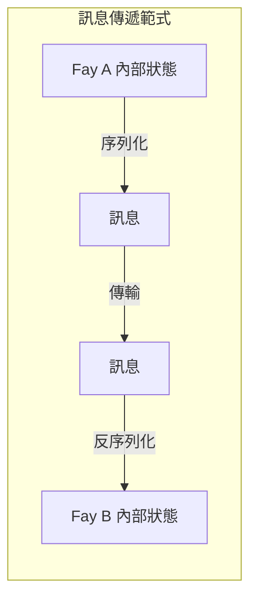
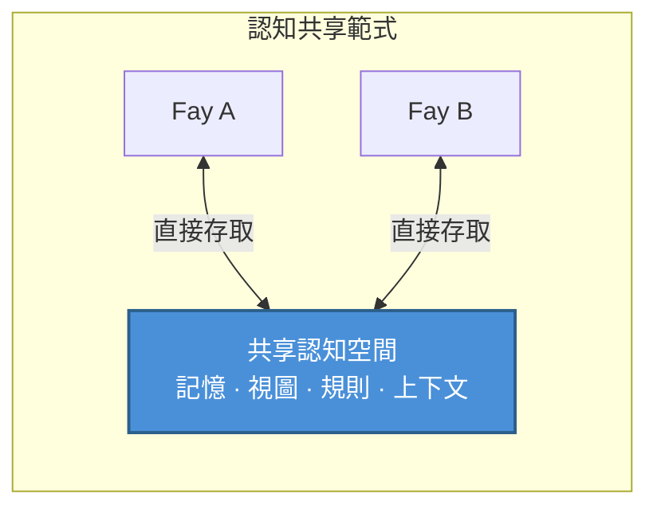

# 第二章 TP 的核心定位

### 2.1 認知共享協定 vs 訊息傳遞協定

理解 TP 的核心定位，需要首先區分兩種截然不同的通訊範式。

#### 訊息傳遞範式：「傳話」模式

傳統通訊協定——從 HTTP 到 gRPC，從 MCP 到 A2A——本質上都遵循同一種範式：**序列化 → 傳輸 → 反序列化**。

發送方將內部狀態編碼為某種線路格式（JSON、Protobuf、XML），透過網路傳輸到接收方，接收方再將線路格式解碼為自己的內部表示。每一次通訊都是一次完整的資訊打包和拆包過程。

這種模式如同「傳話」——信使將說話人的意思記錄下來，跑到另一個人面前複述。資訊在編碼和解碼的過程中，不可避免地會產生損耗：語境丟失、隱含假設遺漏、表達精度下降。

#### 認知共享範式：「心靈感應」模式

TP 提出了一種根本不同的範式：**在授權範圍內建立共享的認知空間，雙方直接存取共享的認知資源**。

在這種模式下，通訊雙方不再需要將所有資訊打包成訊息來回傳遞。相反，它們在一個受控的共享空間中協作——共享的記憶片段、視圖狀態、推理規則和環境上下文構成了雙方共同的認知基礎。

這並不意味著 TP 完全消除了訊息傳輸——建立共享空間本身需要協商和同步。但一旦共享語境建立，後續的協作效率將大幅提升，因為雙方不再需要反覆序列化和傳輸已經共享的認知資源。

### 2.2 「心靈感應」隱喻解讀

「Telepathy（心靈感應）」這個命名並非修辭上的誇張，而是對 TP 核心機制的精確隱喻。

#### 一個具體的場景

設想兩個人在不同地點參加遠端會議。其中一人說：「你看我用紅框框住的那部分資料。」

在人類世界中，這句話要產生意義，需要一系列媒體手段的支撐：螢幕共享軟體將說話人的螢幕畫面即時傳輸到對方的顯示器上；對方需要在自己的螢幕上找到紅框的位置；如果網路延遲或畫面模糊，對方可能看到的是上一幀的畫面，紅框的位置已經變了。

整個過程充滿了資訊傳遞的摩擦：編碼（螢幕像素 → 視訊串流）、傳輸（網路頻寬和延遲）、解碼（視訊串流 → 螢幕像素）、認知對齊（對方需要在自己的視覺空間中定位紅框）。

但如果雙方擁有「心靈感應」能力，情況將截然不同——雙方直接「看到」同一個視圖，紅框的位置、資料的內容、甚至說話人標註紅框時的意圖，都在共享的認知空間中即時可見。沒有編碼損耗，沒有傳輸延遲，沒有認知對齊的成本。

#### 在 Fay-to-Fay 場景中的實現

在人類之間，「心靈感應」是科幻概念。但在 Fay-to-Fay 的場景中，這種共享語境是**可以工程化實現的**。

Fay 的認知狀態本質上是結構化的資料——記憶是可索引的知識圖譜，視圖是可序列化的狀態樹，推理規則是可共享的邏輯引擎。當兩個 Fay 建立 TP 會話時，它們可以在人類原型授權的範圍內，將部分認知資源納入共享空間：

- **會話級別的部分長記憶**：與當前協作主題相關的知識片段
- **視圖介面狀態**：雙方正在操作的介面或資料視圖的即時狀態
- **規則或推理引擎**：用於當前任務的推理邏輯和決策規則
- **環境上下文**：時間、地點、裝置狀態等動態環境資訊

這正是「Telepathy Protocol」命名的由來——它讓 Fay 之間的通訊從「傳話」升級為「心靈相通」。
