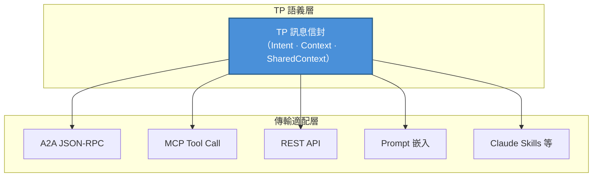
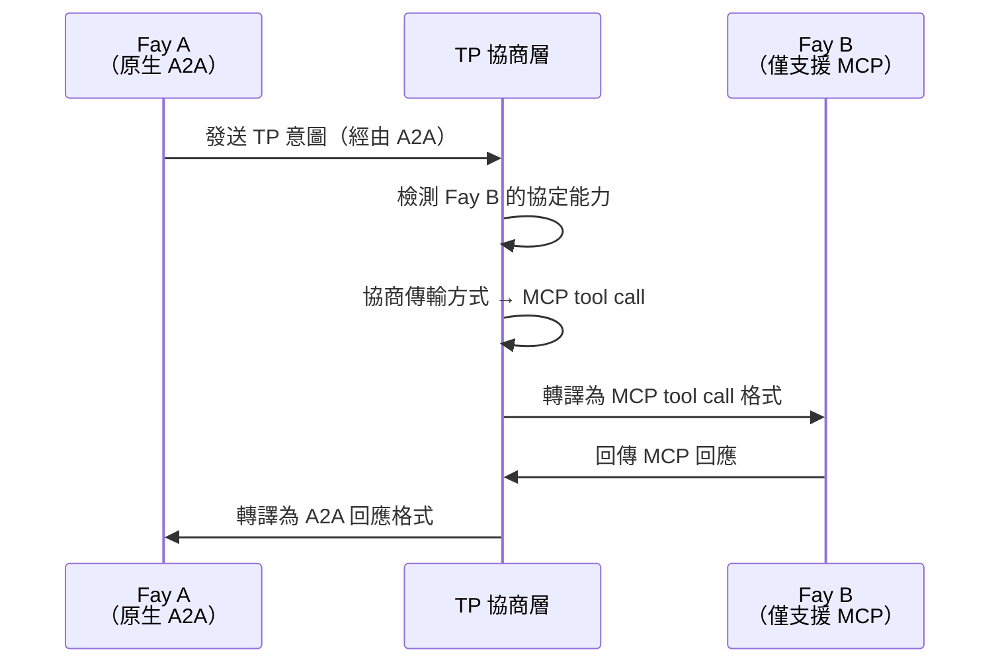

# 第三章 三大獨特能力

TP 的設計圍繞三大獨特能力展開，它們共同構成了 TP 區別於所有現有通訊協定的核心競爭力。

### 3.1 傳輸無關性（Transport Agnosticism）

#### 設計哲學

TP 不替代 MCP 或 A2A，而是在它們之上建立**統一的語義抽象**。

這一設計哲學的核心洞察在於：對於認知共享而言，重要的不是訊息透過什麼管道傳輸，而是訊息承載了什麼語義。TP 訊息可以透過以下任何一種傳輸方式傳遞：

| 傳輸方式 | 說明 |
|---------|------|
| A2A 的 JSON-RPC | 透過 A2A 協定的標準訊息通道傳遞 TP 語義 |
| MCP 的 tool call | 將 TP 訊息封裝為 MCP 工具呼叫的參數 |
| 傳統 REST API | 透過 HTTP 請求體傳遞 TP 訊息信封 |
| Prompt 傳遞 | 將 TP 語義嵌入自然語言 Prompt 中（降級模式） |
| Claude Skills 等新興方式 | 相容未來可能出現的新型 AI 互動範式 |

#### 類比

這種設計可以類比為 HTTP 與傳輸層的關係。HTTP 協定可以執行在 TCP 之上，也可以執行在 QUIC 之上——HTTP 關心的是請求-回應語義，而非底層的傳輸機制。同樣，TP 關心的是認知共享的語義層，而非訊息的傳輸層。

傳輸無關性確保了 TP 不會被綁定到任何單一的底層協定上。當新的傳輸方式出現時，TP 只需增加一個傳輸適配器，而無需修改協定本身的語義定義。

### 3.2 協定協商與轉譯（Protocol Negotiation）

#### 問題場景

在現實的 AI 生態中，不同的 Fay 可能「說」不同的協定語言。一個 Fay 可能原生支援 A2A，另一個可能只理解 MCP 的 tool call 格式，還有一些可能僅支援傳統的 REST API 呼叫。

當這些「母語」不同的 Fay 需要協作時，如果沒有統一的協商和轉譯機制，它們將無法通訊——就像兩個只會說不同語言的人面對面卻無法交流。

#### TP 的解決方案

TP 充當**自適應的翻譯層**，透過以下步驟實現跨協定通訊：

1. **能力探測**：TP 首先探測對方 Fay 支援哪些傳輸協定
2. **合約協商**：雙方約定一個「合約範本」——確定使用 MCP、A2A、API 呼叫還是 Prompt 作為底層傳輸方式
3. **語義映射**：在約定的傳輸方式之上，建立 TP 語義到底層協定格式的映射規則
4. **透明轉譯**：後續通訊中，TP 自動將語義意圖轉譯為對方能理解的格式

這種機制的關鍵價值在於：即使對方 Fay 尚未「學會」某種協定，TP 也能透過轉譯讓雙方順利通訊。協定的差異對上層的認知共享邏輯完全透明。

### 3.3 共享語境（Shared Context）

#### 核心地位

共享語境是 TP 最核心的能力，也是「心靈感應」命名的根本由來。如果說傳輸無關性解決了「透過什麼管道通訊」的問題，協定協商解決了「用什麼語言通訊」的問題，那麼共享語境解決的是「通訊的本質是什麼」的問題。

#### 機制描述

當兩個 Fay 啟用 TP 會話時，雙方會進入**共享語境模式**。在這一模式下，雙方不再僅僅交換訊息，而是共同維護一個受控的認知空間。

可共享的認知資源包括：

| 認知資源類型 | 說明 | 典型場景 |
|------------|------|---------|
| 會話級別的部分長記憶 | 與當前協作主題相關的知識片段 | 醫療 Fay 共享患者的相關病史摘要——如過敏史、慢性病記錄、近期用藥情況，使得會診 Fay 無需重新詢問即可了解患者背景 |
| 視圖介面狀態 | 雙方正在操作的介面或資料視圖 | 多個 Fay 協作編輯同一份合約文本——法律 Fay 標註了需要修改的條款，財務 Fay 立即看到標註位置並評估財務影響，無需來回傳送文件版本 |
| 規則或推理引擎 | 用於當前任務的推理邏輯 | 法律 Fay 共享適用的法規條文和推理鏈——稅務 Fay 可以直接引用這些法規來計算稅務影響，而不需要法律 Fay 每次都把相關法條複製貼上到訊息中 |
| 環境上下文 | 時間、地點、裝置狀態等動態資訊 | 無人機上的 Fay 共享即時 GPS 座標、電池電量、攝影機視角給地面控制 Fay——地面 Fay 可以直接「感知」無人機的狀態，而非等待定期的狀態報告訊息 |

#### 宿主授權與稽核

共享語境的範圍嚴格由**宿主授權**決定。Fay 不能自行決定共享哪些認知資源——每一項共享都必須在宿主預先授權的邊界內進行。同時，所有對共享語境的存取均**可稽核**，宿主可以事後查閱哪些資訊被共享、被誰存取、在什麼時間點發生。

這一設計與 A2A 的 Opaque Execution 原則形成了鮮明對比：

| 維度 | A2A（Opaque Execution） | TP（Shared Context） |
|------|------------------------|---------------------|
| 內部狀態 | 不共享，Agent 是黑盒 | 在授權範圍內選擇性共享 |
| 協作深度 | 任務級別（委派與匯報） | 認知級別（共享記憶與推理） |
| 資訊傳遞 | 每次完整序列化傳輸 | 共享空間內直接存取 |
| 隱私控制 | 無系統性機制 | 宿主授權 + 全程稽核 |
| 適用場景 | 鬆耦合的服務編排 | 深度協作與認知融合 |

共享語境使得 Fay 之間的協作從「傳話」升級為「共同思考」——這是 TP 作為認知共享協定的核心價值所在。
