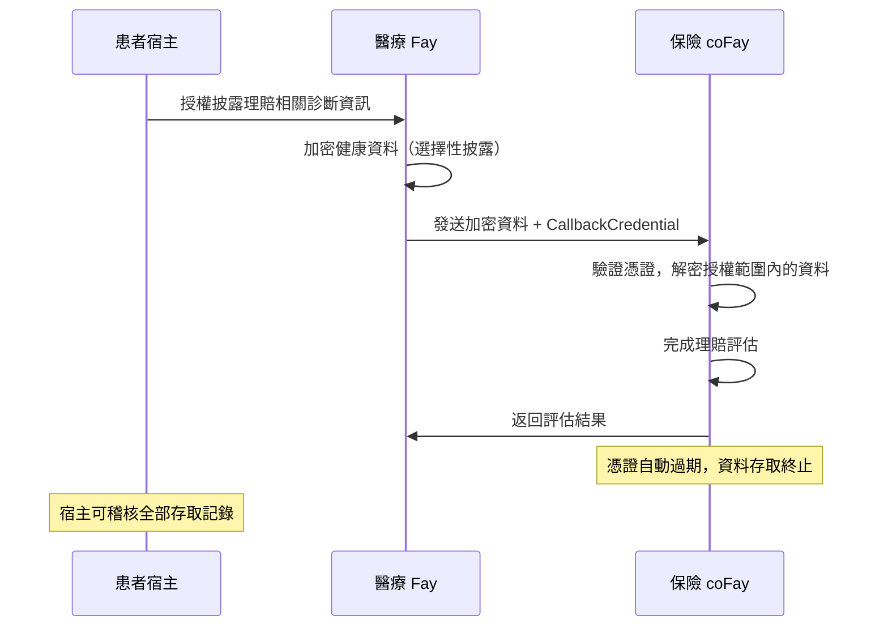
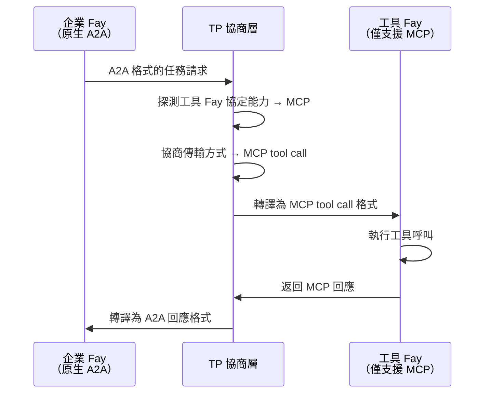
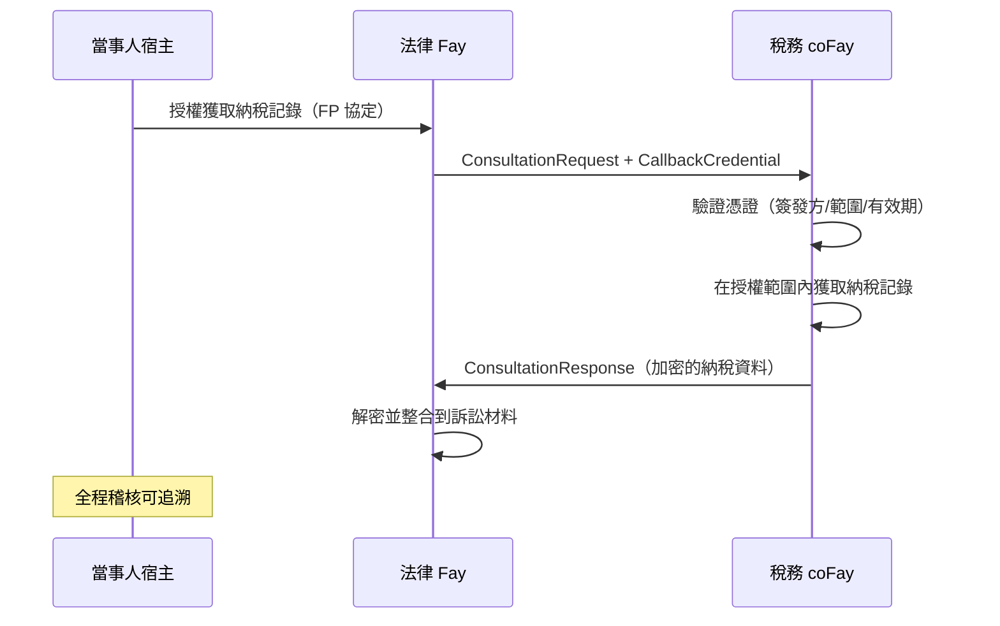
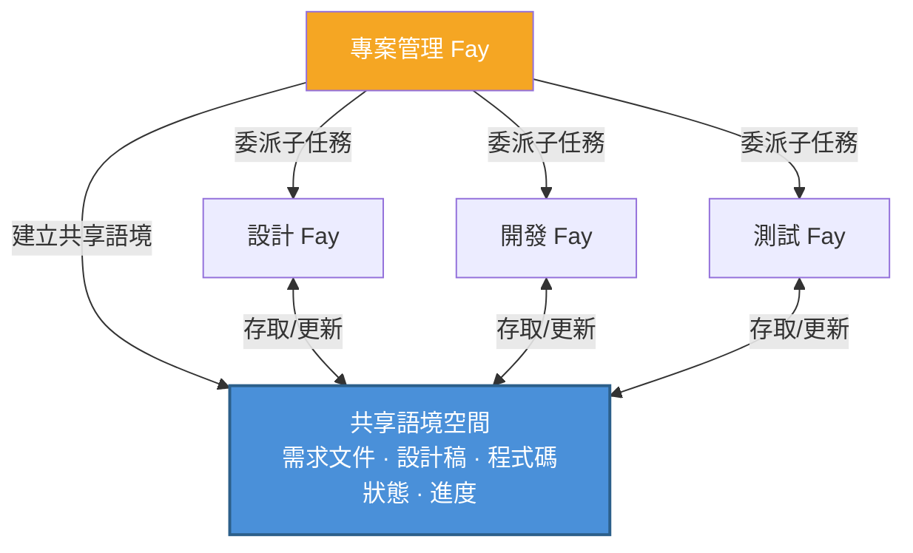
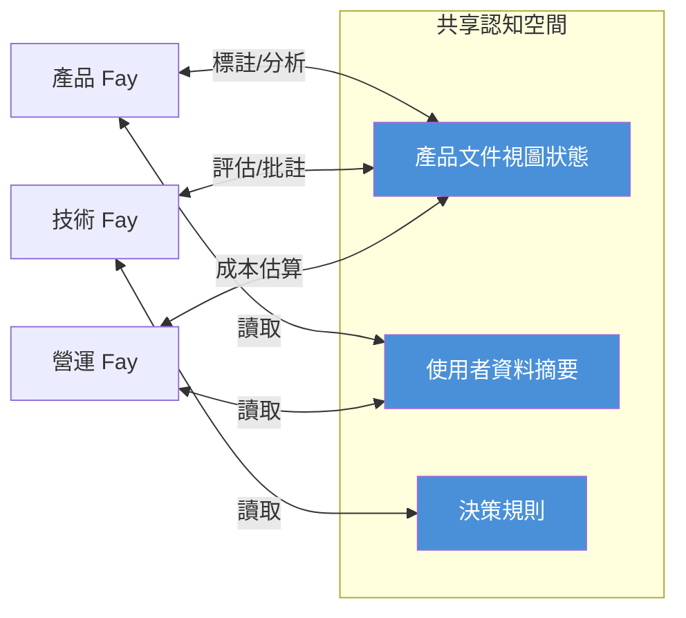

# 第四章 應用場景

以下五個場景展示了 TP 在不同業務領域中的實際應用，涵蓋隱私委託、跨協定橋接、憑證傳遞、多 Fay 協作和共享語境會議等核心能力。

### 4.1 隱私委託諮詢

**場景**：患者宿主需要透過其醫療 Fay 向保險 coFay 提交健康資料以獲取理賠評估。

在傳統的 Agent 通訊模式下，醫療 Agent 需要將患者的完整健康記錄序列化為訊息發送給保險 Agent——這意味著所有資料以明文形式在網路上傳輸，且接收方獲得了遠超必要範圍的資訊存取權限。

在 TP 的認知共享模式下，流程截然不同：

1. **宿主授權**：患者宿主透過 FP 協定向醫療 Fay 授權，明確指定僅允許披露與本次理賠相關的診斷資訊（如診斷編碼、治療日期、費用明細），其餘健康記錄（如心理諮詢記錄、基因檢測結果）保持加密不可見
2. **選擇性披露**：醫療 Fay 使用 TP 的 `SelectiveDisclosure` 機制，將授權範圍內的資料加密傳輸給保險 coFay，同時附帶一個有時效性的 `CallbackCredential`
3. **受控存取**：保險 coFay 透過回呼憑證在限定範圍內存取授權資料，完成理賠評估
4. **自動過期**：評估完成後，回呼憑證自動過期，保險 coFay 無法再存取任何患者資料
5. **全程稽核**：所有資料存取記錄均被記錄在稽核日誌中，患者宿主可隨時查閱

這一場景體現了 TP 的**宿主主權隱私**原則——資料的披露範圍始終由宿主決定，而非由 Fay 自行判斷。

### 4.2 跨協定翻譯

**場景**：一個原生支援 A2A 的企業 Fay 需要呼叫一個僅支援 MCP tool call 的專業工具 Fay。

在沒有 TP 的世界中，這兩個 Fay 根本無法直接通訊——它們「說」的是完全不同的協定語言。企業 Fay 發出的 A2A JSON-RPC 請求，工具 Fay 無法解析；工具 Fay 暴露的 MCP tool call 介面，企業 Fay 也無法呼叫。開發者不得不為每一對協定組合編寫專用的適配器。

TP 的協定協商與轉譯機制徹底改變了這一局面：

1. **能力探測**：企業 Fay 透過 TP 發起通訊請求，TP 協商層自動探測工具 Fay 的協定能力，發現其僅支援 MCP tool call
2. **合約協商**：TP 在雙方之間協商傳輸方式，確定使用 MCP tool call 作為底層傳輸通道
3. **語義映射**：TP 將企業 Fay 發出的 A2A 格式任務請求中的意圖（Intent）、參數（Parameters）和上下文（Context）映射為 MCP tool call 的輸入格式
4. **透明轉譯**：工具 Fay 收到的是標準的 MCP tool call 請求，完全無感知 TP 的存在；執行完成後，TP 將 MCP 回應轉譯回 A2A 格式返回給企業 Fay

這一場景的關鍵價值在於：**協定差異對上層業務邏輯完全透明**。企業 Fay 不需要知道對方使用什麼協定，也不需要為每種協定編寫適配程式碼。TP 的自適應轉譯層讓異構協定生態中的 Fay 能夠無縫協作。

### 4.3 憑證傳遞諮詢

**場景**：法律 Fay（代表當事人宿主）向稅務 coFay 發起諮詢，需要獲取當事人的納稅記錄以支援訴訟準備。

這一場景類似於現實世界中律師代表當事人向稅務機關調取資料——律師需要出示當事人的授權委託書，稅務機關在核實授權後提供限定範圍內的資料，且整個過程有據可查。

TP 的諮詢模式（Consultation）和回呼憑證機制（CallbackCredential）精確地映射了這一現實流程：

1. **宿主委託**：當事人宿主透過 FP 協定向法律 Fay 授權，允許其代為獲取納稅記錄
2. **諮詢發起**：法律 Fay 向稅務 coFay 發送 `ConsultationRequest`，附帶一個有時效性的 `CallbackCredential`，授權稅務 coFay 在限定範圍內存取當事人的財務資料
3. **憑證驗證**：稅務 coFay 驗證回呼憑證的有效性——檢查簽發方身份、授權範圍、有效期
4. **受控資料獲取**：稅務 coFay 透過憑證存取當事人的納稅記錄，但僅限於憑證 `scope` 中指定的年度和稅種
5. **端到端加密**：整個資料傳輸過程使用 TP 的 `EncryptedPayload` 機制進行端到端加密
6. **稽核追蹤**：所有憑證使用和資料存取記錄均被寫入稽核日誌，當事人宿主可隨時查閱

這一場景展示了 TP 如何將現實世界中「代理人持授權書辦事」的模式數位化——憑證有時效、有範圍、可撤銷、可稽核，完整地保護了宿主的權益。

### 4.4 多 Fay 協作任務

**場景**：專案管理 Fay 將一個複雜的產品開發專案分解為多個子任務，分別委派給設計 Fay、開發 Fay 和測試 Fay。

在 A2A 的 Opaque Execution 模式下，專案管理 Fay 每次與子任務 Fay 互動時，都需要將完整的專案上下文（需求文件、設計稿、程式碼倉庫狀態、進度報告）序列化傳輸。隨著專案推進，上下文不斷膨脹，每一輪互動的資訊傳輸量越來越大，且在反覆的序列化與反序列化過程中，細節資訊不可避免地產生損耗。

TP 的共享語境機制從根本上改變了這一協作模式：

1. **共享專案上下文**：專案管理 Fay 建立一個共享語境空間，將專案的核心認知資源納入其中——需求文件的結構化表示、設計稿的版本狀態、程式碼倉庫的變更摘要、各子任務的進度和依賴關係
2. **任務分解與委派**：專案管理 Fay 透過 TP 的 `TaskMessage` 將專案分解為子任務，分別委派給設計 Fay（UI/UX 設計）、開發 Fay（程式碼實作）和測試 Fay（品質驗證）
3. **上下文繼承**：每個子任務自動繼承共享語境中的相關上下文，無需專案管理 Fay 每次都重複傳遞完整的專案資訊
4. **即時同步**：當設計 Fay 更新了設計稿，開發 Fay 和測試 Fay 透過共享語境立即「感知」到變更，無需等待專案管理 Fay 轉發通知
5. **依賴管理**：子任務之間的依賴關係（如「開發依賴設計完成」、「測試依賴開發完成」）透過 TP 的 `SubtaskReference` 機制自動管理

這一場景體現了共享語境相對於訊息傳遞的核心優勢：**專案上下文是「活的」**——它隨著專案推進而持續更新，所有參與方始終基於同一份最新的認知基礎進行協作，而非依賴滯後的訊息快照。

### 4.5 共享語境會議

**場景**：產品 Fay、技術 Fay 和營運 Fay 需要共同討論一個新產品方案，三方需要在同一份產品文件上進行即時協作。

在人類世界中，遠端會議需要螢幕共享、即時通訊、文件協作等多種工具的配合，資訊在不同媒介之間傳遞時不可避免地產生延遲和損耗。在 Agent 世界中，如果使用傳統的訊息傳遞模式，情況更加複雜——每個 Agent 維護自己的文件副本，透過訊息同步變更，衝突解決和狀態一致性成為巨大的工程挑戰。

TP 的共享語境機制讓多 Fay 即時協作變得自然而高效：

1. **建立共享認知空間**：三個 Fay 透過 TP 建立一個共享語境會話，將以下認知資源納入共享空間：
   - 產品文件的結構化視圖狀態（章節、標註、批註）
   - 相關的使用者資料摘要（脫敏後的使用統計、回饋分析）
   - 決策規則（產品優先級矩陣、技術可行性評估標準、營運成本模型）

2. **即時認知同步**：當產品 Fay 在文件上標註「這部分需要重新設計」時，技術 Fay 和營運 Fay 立即「看到」標註的位置和內容——不是透過訊息通知，而是透過共享語境空間的直接存取。這正是「心靈感應」隱喻的具體實現

3. **多視角協作**：三個 Fay 從各自的專業視角對同一份文件進行分析和標註——產品 Fay 關注使用者體驗，技術 Fay 評估實作複雜度，營運 Fay 估算營運成本。所有標註和分析結果在共享空間中即時可見

4. **決策記錄**：會議過程中的所有討論、標註和決策均被記錄在共享語境中，形成可追溯的決策鏈

這一場景是 TP「心靈感應」理念的最完整體現——多個 Fay 不再需要透過訊息「傳話」，而是在共享的認知空間中「共同思考」。資訊的傳遞從「編碼 → 傳輸 → 解碼」的串行流程，變為「共享空間中的直接感知」。
