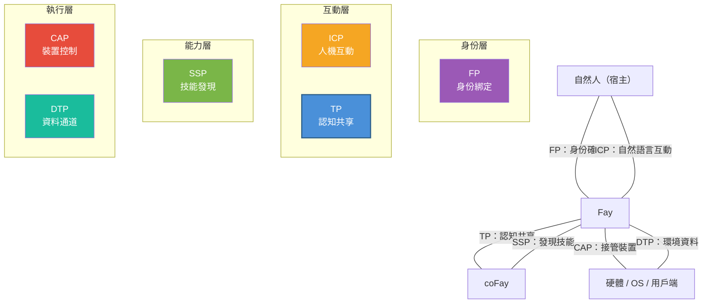

# 第五章 生態定位

### 5.1 iFay 六協定關係圖

TP 並非孤立存在，它是 iFay 生態體系中六大協定之一。每個協定各司其職，共同構成了一個完整的 AI 代理通訊框架。

| 協定 | 全稱 | 核心職責 | 面向領域 |
|------|------|---------|---------|
| **ICP** | Interactive Conversation Protocol | 人 ↔ Fay 的互動中間語言 | 人機接觸面 |
| **TP** | Telepathy Protocol | Fay ↔ Fay 的認知共享 | Fay 間協作 |
| **CAP** | Control Authority Protocol | Fay → 硬體/用戶端的接管 | 裝置控制 |
| **SSP** | Skill Sharing Protocol | Fay 的技能發現 | 能力市場 |
| **DTP** | Data Tunnel Protocol | 硬體/OS → Fay 的資料通道 | 環境感知 |
| **FP** | Faying Protocol | 自然人 ↔ iFay 的身份綁定 | 身份確權 |

六大協定的互動關係如下圖所示：

**協定間的協作關係：**

- **FP → TP**：FP 確立宿主與 Fay 的身份綁定關係，TP 在通訊中引用 FP 授權來驗證宿主委託的合法性。例如，當患者的 iFay 向醫院 coFay 發起掛號請求時，醫院 coFay 透過 FP 授權引用確認「這個 iFay 確實被該患者授權代為掛號」。
- **ICP → TP**：宿主透過 ICP 向自己的 Fay 下達指令，Fay 透過 TP 將任務委派給其他 Fay 執行。例如，使用者對自己的 iFay 說「幫我預訂下週去東京的機票」（ICP 互動），iFay 隨後透過 TP 聯繫航空公司的 coFay 完成預訂。
- **SSP ↔ TP**：Fay 透過 SSP 發現其他 Fay 的可用技能，然後透過 TP 發起具體的協作請求。例如，iFay 透過 SSP 發現了一個擅長稅務籌劃的 coFay，然後透過 TP 建立共享語境，將宿主的財務資料（在授權範圍內）掛載到共享空間中進行諮詢。
- **TP → CAP**：當 TP 協作任務需要操控硬體或用戶端時，Fay 透過 CAP 憑證獲取裝置控制權。例如，一個人工控制的無人機需要交接給某個 Fay 接管——地面操作員的 iFay 透過 TP 與無人機上的 Fay 協商控制權交接，然後透過 CAP 協定完成實際的控制權轉移。
- **DTP → TP**：硬體和作業系統透過 DTP 向 Fay 推送環境資料，Fay 將這些資料納入 TP 共享語境中供協作方使用。例如，智慧家居系統透過 DTP 向 iFay 推送室內溫度、濕度和空氣品質資料，iFay 將這些環境資料掛載到與健康管理 coFay 的共享語境中，輔助健康建議的生成。

### 5.2 與 MCP/A2A 的對比

TP 與 MCP、A2A 並非競爭關係，而是互補關係——TP 可以執行在 MCP 或 A2A 之上。以下對比表從多個維度展示三者的定位差異：

| 維度 | MCP | A2A | TP |
|------|-----|-----|-----|
| **發布方** | Anthropic | Google | iFay 開源社群 |
| **發布時間** | 2024 | 2025 | 2025 |
| **核心定位** | AI 模型與外部工具的連接協定 | Agent 之間的任務委派與協作協定 | Fay 之間的認知共享協定 |
| **通訊方向** | 單向（AI → 工具） | 雙向（Agent ↔ Agent） | 雙向 + 共享空間（Fay ↔ 共享語境 ↔ Fay） |
| **身份歸屬** | 無（工具無歸屬概念） | 無（Agent 是自治服務節點） | 有（每個 Fay 代表宿主行事） |
| **隱私保護** | 無系統性機制（明文參數傳遞） | 無系統性機制 | 端到端加密 + 選擇性披露 + 宿主授權 |
| **內部狀態共享** | 不適用（工具是無狀態函式） | 不共享（Opaque Execution） | 在授權範圍內選擇性共享（Shared Context） |
| **傳輸方式** | 綁定 tool call（JSON-RPC） | 綁定 JSON-RPC over HTTP | 傳輸無關（可透過 A2A/MCP/API/Prompt 傳遞） |
| **協定協商** | 無 | 無 | 自適應協商與轉譯 |
| **適用場景** | AI 呼叫外部工具和資料來源 | 鬆耦合的 Agent 服務編排 | 深度協作、隱私委託、認知融合 |

三者的關係可以用一句話概括：**MCP 讓 AI 能用工具，A2A 讓 Agent 能傳話，TP 讓 Fay 能心靈相通**。

TP 的傳輸無關性意味著它可以「騎」在 MCP 或 A2A 之上——當底層使用 A2A 傳輸時，TP 為其增加了身份歸屬、隱私保護和共享語境能力；當底層使用 MCP 傳輸時，TP 將單向的工具呼叫升級為雙向的認知共享。
