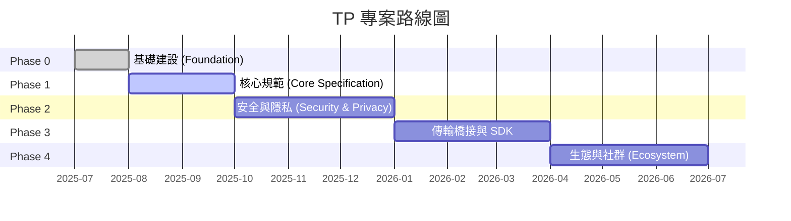

# 第七章 交付物與路線圖

### 7.1 三級交付物清單

TP 專案的所有交付物按優先級分為三個層級：

#### Tier 1 — 核心交付物（Must-Have）

| 交付物 | 目標階段 | 依賴 |
|--------|---------|------|
| 藍圖文件（zh-CN + en） | Phase 0 | 無 |
| TP 協定規範草案 | Phase 1 | 藍圖文件 |
| JSON Schema 定義（MessageEnvelope, Intent, Capability, Task, Context, SharedContext） | Phase 1 | 協定規範 |
| TypeScript 型別定義 | Phase 1 | JSON Schema |
| TypeScript 參考 SDK | Phase 3 | Schema + 協定規範 |

#### Tier 2 — 重要交付物（Should-Have）

| 交付物 | 目標階段 | 依賴 |
|--------|---------|------|
| MDX 人類可讀文件 | Phase 1 | JSON Schema |
| 多語言協定文件（9 種語言） | Phase 4 | 源語言文件 |
| 開發者指南（快速入門 + 架構概覽） | Phase 1 | 藍圖文件 |
| SDK 使用指南與 API 參考 | Phase 3 | TypeScript SDK |

#### Tier 3 — 增強交付物（Nice-to-Have）

| 交付物 | 目標階段 | 依賴 |
|--------|---------|------|
| 社群貢獻指南與治理文件 | Phase 0 | 無 |
| 協定一致性測試套件 | Phase 4 | SDK + Schema |
| 範例應用專案 | Phase 4 | SDK |

### 7.2 路線圖

#### Phase 0: Foundation（基礎建設）

Phase 0 的核心目標是建立專案的基礎設施和頂層敘事。主要里程碑包括：發布藍圖文件的中英雙語版本，確立 TP 作為認知共享協定的核心定位；確定專案目錄結構和命名規範；建立 README.md、CONTRIBUTING.md、CODE_OF_CONDUCT.md 等開源治理檔案；建立 Schema 版本管理規範（日期命名、三檔案同步、向後相容規則）；將早期的 agent-to-agent-protocol spec 標記為 deprecated，正式由 telepathy-protocol spec 取代。Phase 0 的準出標準是藍圖文件雙語發布且倉庫基礎設施就緒。

#### Phase 1: Core Specification（核心規範）

Phase 1 聚焦於 TP 協定的核心技術規範。主要里程碑包括：發布 TP 協定規範草案，定義共享語境語義和傳輸無關的訊息信封格式；交付 JSON Schema 和 TypeScript 型別定義，涵蓋 MessageEnvelope、Intent、Capability、Task、Context、SharedContext 等核心資料結構；交付 MDX 格式的人類可讀文件；發布開發者快速入門指南。Phase 1 的準出標準是核心 Schema 三檔案（.json / .ts / .mdx）通過一致性校驗，且規範草案完成 review。

#### Phase 2: Security, Privacy and Shared Context（安全、隱私與共享語境）

Phase 2 深入安全和隱私領域。主要里程碑包括：交付加密和憑證相關的 Schema 定義（EncryptedPayload、CallbackCredential）；發布安全規範，涵蓋端到端加密、認證機制和宿主委託授權；定義共享語境的完整生命週期管理——建立、範圍界定、過期和撤銷；建立 Technical Steering Committee（TSC）治理機制。Phase 2 的準出標準是安全 Schema 通過一致性校驗，且 TSC 章程正式發布。

#### Phase 3: Transport Bridges and SDK（傳輸橋接與 SDK）

Phase 3 將協定規範轉化為可執行的程式碼。主要里程碑包括：交付 TypeScript 參考 SDK，實作核心訊息處理邏輯；實作 A2A 和 MCP 的協定橋接介面，驗證傳輸無關性和協定協商能力；交付姊妹協定（ICP、SSP、CAP、DTP、FP）的橋接介面；發布 SDK 文件和使用範例。Phase 3 的準出標準是 SDK 通過所有單元測試和屬性測試，橋接介面通過整合測試。

#### Phase 4: Ecosystem and Community（生態與社群）

Phase 4 將 TP 從技術專案擴展為開放生態。主要里程碑包括：完成 9 種語言的多語言文件翻譯；交付協定一致性測試套件，供第三方實作驗證合規性；發布範例應用專案，展示共享語境在實際業務場景中的應用；建立 RFC 流程，為協定的持續演進提供社群驅動的治理機制。Phase 4 的準出標準是翻譯狀態儀表板顯示所有 Tier 1 和 Tier 2 文件翻譯完成。

